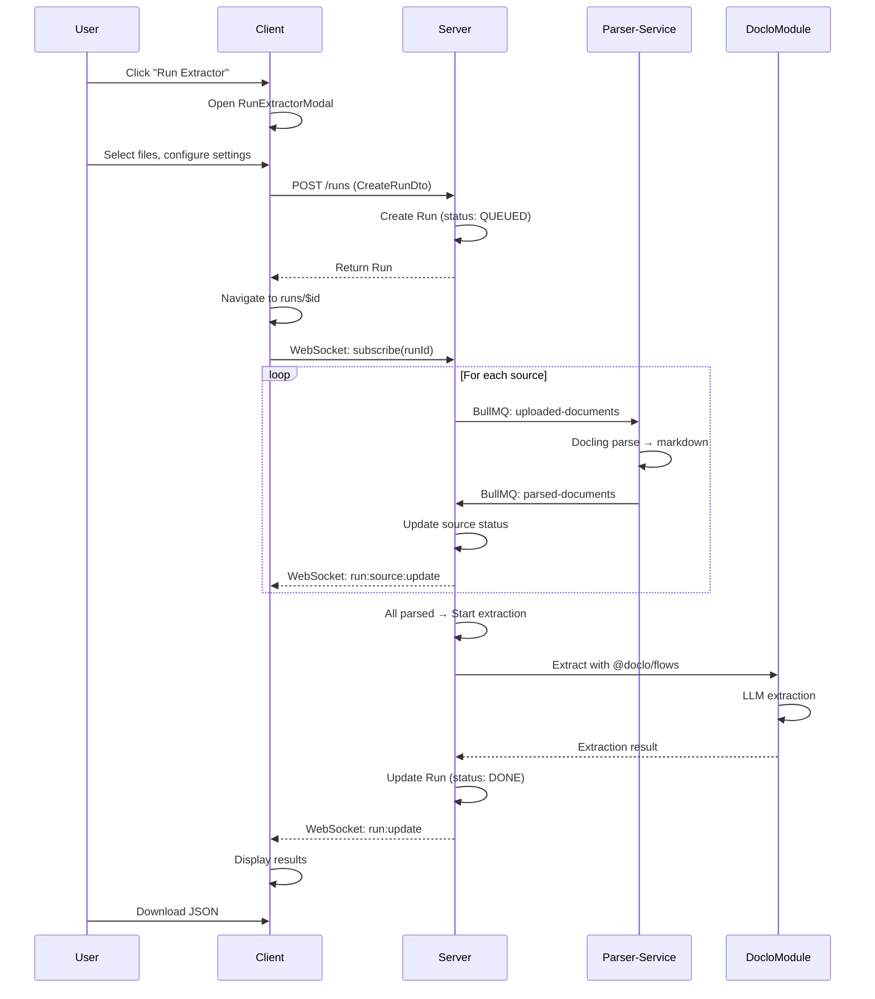
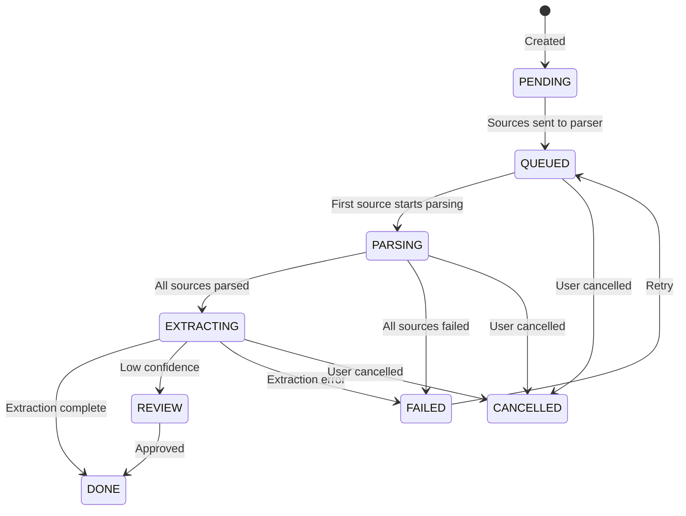

# Run Extraction System - Implementation Plan

## Overview

Implement a complete document extraction pipeline where users can run extractors on documents, monitor progress in real-time, review results, and download extracted data.

**User Flow:**

1. User opens `RunExtractorModal` from an extractor's page
2. User selects files/URLs to process
3. System creates a Run and automatically processes documents
4. User navigates to `runs/$id` to monitor real-time progress
5. If review needed → `review/$id` for human verification
6. View/download results from `runs/$id` when complete

**Key Architecture Decisions:**

- **Parser-service (Python)**: Existing Docling-based parser for document → markdown
- **Doclo Module (Internal)**: @doclo/flows inside core server for extraction (default)
- **LangExtract Worker (Future)**: Optional external worker for alternative extraction
- **WebSocket**: Real-time updates from server to client only
- **BullMQ**: Server ↔ Worker communication and job management

---

## System Architecture

```mermaid
flowchart TB
    subgraph Client["Client (React)"]
        MODAL[RunExtractorModal]
        LIST[runs/index.tsx]
        DETAIL[runs/$id.tsx]
        REVIEW[review/$id.tsx]
        WS[Socket.IO Client]
    end

    subgraph Server["Core Backend (NestJS)"]
        API[RunsController]
        SVC[RunsService]
        WS_GW[RunsGateway]
        DOCLO[DocloModule<br/>@doclo/flows]
        BULL_PROD[BullMQ Producer]
        BULL_CONS[BullMQ Consumer]
        DB[(PostgreSQL)]
        REDIS[(Redis)]
    end

    subgraph Workers["Parser Service (Python)"]
        PARSER[Docling Parser]
    end

    subgraph FutureWorkers["Future: Optional Workers"]
        LANGX[LangExtract Worker]
    end

    MODAL -->|Create Run| API
    LIST -->|List Runs| API
    DETAIL -->|Get Run| API
    REVIEW -->|Submit Review| API
    WS <-.->|Real-time updates| WS_GW

    API --> SVC
    SVC --> DB
    SVC --> BULL_PROD
    SVC --> DOCLO
    SVC --> WS_GW

    BULL_PROD -->|uploaded-documents| PARSER
    PARSER -->|parsed-documents| BULL_CONS
    BULL_CONS --> SVC

    SVC -.->|Future: extraction-requests| LANGX
    LANGX -.->|extraction-completed| BULL_CONS
```

---

## Data Flow

### Complete Run Lifecycle



---

## Run Status Flow


