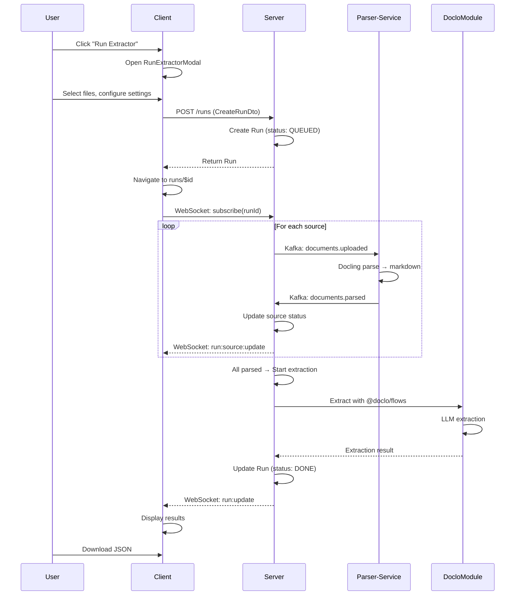
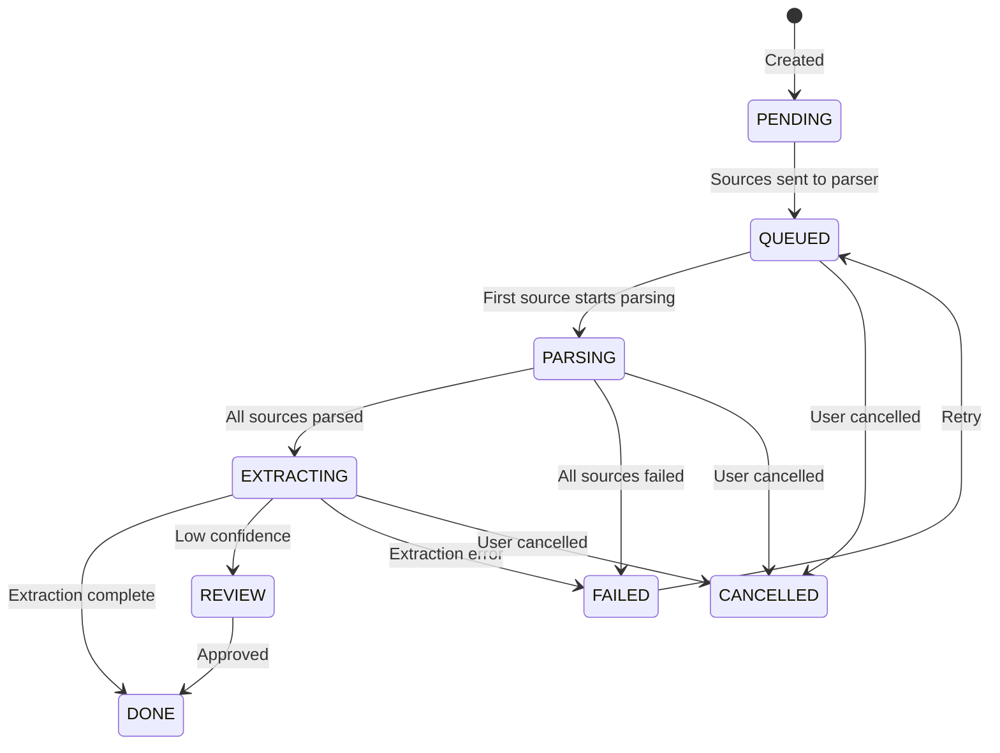

# Run Extraction System - Implementation Plan

## Overview

Implement a complete document extraction pipeline where users can run extractors on documents, monitor progress in real-time, review results, and download extracted data.

**User Flow:**
1. User opens `RunExtractorModal` from an extractor's page
2. User selects files/URLs to process
3. System creates a Run and automatically processes documents
4. User navigates to `runs/$id` to monitor real-time progress
5. If review needed → `review/$id` for human verification
6. View/download results from `runs/$id` when complete

**Key Architecture Decisions:**
- **Parser-service (Python)**: Existing Docling-based parser for document → markdown
- **Doclo Module (Internal)**: @doclo/flows inside core server for extraction (default)
- **LangExtract Worker (Future)**: Optional external worker for alternative extraction
- **WebSocket**: Real-time updates from server to client only
- **Kafka**: Server ↔ Parser communication only

---

## System Architecture

```mermaid
flowchart TB
    subgraph Client["Client (React)"]
        MODAL[RunExtractorModal]
        LIST[runs/index.tsx]
        DETAIL[runs/$id.tsx]
        REVIEW[review/$id.tsx]
        WS[Socket.IO Client]
    end
    
    subgraph Server["Core Backend (NestJS)"]
        API[RunsController]
        SVC[RunsService]
        WS_GW[RunsGateway]
        DOCLO[DocloModule<br/>@doclo/flows]
        KAFKA_PROD[Kafka Producer]
        KAFKA_CONS[Kafka Consumer]
        DB[(PostgreSQL)]
    end
    
    subgraph Workers["Parser Service (Python)"]
        PARSER[Docling Parser]
    end
    
    subgraph FutureWorkers["Future: Optional Workers"]
        LANGX[LangExtract Worker]
    end
    
    MODAL -->|Create Run| API
    LIST -->|List Runs| API
    DETAIL -->|Get Run| API
    REVIEW -->|Submit Review| API
    WS <-.->|Real-time updates| WS_GW
    
    API --> SVC
    SVC --> DB
    SVC --> KAFKA_PROD
    SVC --> DOCLO
    SVC --> WS_GW
    
    KAFKA_PROD -->|documents.uploaded| PARSER
    PARSER -->|documents.parsed| KAFKA_CONS
    KAFKA_CONS --> SVC
    
    SVC -.->|Future: langextract| LANGX
    LANGX -.->|extraction.completed| KAFKA_CONS
```

---

## Data Flow

### Complete Run Lifecycle



---

## Run Status Flow



---

## Proposed Changes

---

### Phase 1: Run Entity & DTOs

#### 1.1 [MODIFY] [run.entity.ts](file:///Users/salman/Pets/docXtractor/server/src/runs/entities/run.entity.ts)

```typescript
import {
  Entity,
  PrimaryGeneratedColumn,
  Column,
  CreateDateColumn,
  UpdateDateColumn,
  ManyToOne,
  JoinColumn,
  Index,
} from 'typeorm';
import { ApiProperty, ApiPropertyOptional } from '@nestjs/swagger';
import { Extractor } from '../../extractors/entities/extractor.entity';
import { User } from '../../user/entities/user.entity';

// Enums
export enum RunStatus {
  PENDING = 'pending',
  QUEUED = 'queued',
  PARSING = 'parsing',
  EXTRACTING = 'extracting',
  DONE = 'done',
  FAILED = 'failed',
  CANCELLED = 'cancelled',
  REVIEW = 'review',
}

export enum ProcessingMode {
  UNIFIED = 'unified',         // Combine all docs, extract once
  PER_DOCUMENT = 'per_document', // Extract each doc separately
}

export enum ExtractionProvider {
  DOCLO = 'doclo',             // Default: internal @doclo/flows
  LANGEXTRACT = 'langextract', // Future: external Python worker
}

// JSONB Interfaces
export interface RunSource {
  id: string;
  type: 'file' | 'url';
  name: string;
  url?: string;
  fileId?: string;
  fileKey?: string;           // S3/MinIO key for parser
  status: 'pending' | 'parsing' | 'parsed' | 'failed';
  error?: string;
  parsedContent?: string;
  tokenCount?: number;
}

export interface RunProgress {
  parsed: number;
  total: number;
  currentStep: 'queued' | 'parsing' | 'extracting' | 'complete';
}

export interface RunLogEntry {
  timestamp: string;
  level: 'info' | 'warn' | 'error';
  message: string;
}

export interface RunMetrics {
  totalDurationMs?: number;
  totalCostUSD?: number;
  totalInputTokens?: number;
  totalOutputTokens?: number;
}

// Entity
@Entity('runs')
@Index(['userId', 'status'])
@Index(['extractorId'])
@Index(['createdAt'])
export class Run {
  @PrimaryGeneratedColumn('uuid')
  @ApiProperty()
  id: string;

  @Column('uuid')
  @ApiProperty()
  extractorId: string;

  @Column('uuid')
  @ApiProperty()
  userId: string;

  @Column({ type: 'jsonb' })
  @ApiProperty()
  sources: RunSource[];

  @Column({ type: 'enum', enum: ProcessingMode, default: ProcessingMode.UNIFIED })
  @ApiProperty({ enum: ProcessingMode })
  processingMode: ProcessingMode;

  @Column({ type: 'enum', enum: ExtractionProvider, default: ExtractionProvider.DOCLO })
  @ApiProperty({ enum: ExtractionProvider })
  extractionProvider: ExtractionProvider;

  @Column({ type: 'enum', enum: RunStatus, default: RunStatus.PENDING })
  @ApiProperty({ enum: RunStatus })
  status: RunStatus;

  @Column({ type: 'jsonb', nullable: true })
  @ApiPropertyOptional()
  progress: RunProgress | null;

  @Column({ type: 'jsonb', nullable: true })
  @ApiPropertyOptional()
  results: Record<string, unknown> | null;

  @Column({ type: 'jsonb', nullable: true })
  @ApiPropertyOptional()
  metrics: RunMetrics | null;

  @Column({ type: 'jsonb', default: [] })
  @ApiProperty()
  logs: RunLogEntry[];

  @Column({ type: 'text', nullable: true })
  @ApiPropertyOptional()
  error: string | null;

  @Column({ type: 'float', nullable: true })
  @ApiPropertyOptional()
  confidence: number | null;

  // Future: Autorun support
  @Column({ type: 'uuid', nullable: true })
  @ApiPropertyOptional()
  autorunId: string | null;

  @Column({ default: false })
  @ApiProperty()
  isAutorun: boolean;

  @Column({ type: 'timestamp', nullable: true })
  @ApiPropertyOptional()
  startedAt: Date | null;

  @Column({ type: 'timestamp', nullable: true })
  @ApiPropertyOptional()
  finishedAt: Date | null;

  @CreateDateColumn()
  @ApiProperty()
  createdAt: Date;

  @UpdateDateColumn()
  @ApiProperty()
  updatedAt: Date;

  // Relations
  @ManyToOne(() => Extractor, { onDelete: 'CASCADE' })
  @JoinColumn({ name: 'extractorId' })
  extractor: Extractor;

  @ManyToOne(() => User, { onDelete: 'CASCADE' })
  @JoinColumn({ name: 'userId' })
  user: User;
}
```

#### 1.2 [MODIFY] [create-run.dto.ts](file:///Users/salman/Pets/docXtractor/server/src/runs/dto/create-run.dto.ts)

```typescript
import { ApiProperty, ApiPropertyOptional } from '@nestjs/swagger';
import { IsArray, IsBoolean, IsEnum, IsOptional, IsString, IsUUID, ValidateNested } from 'class-validator';
import { Type } from 'class-transformer';
import { ProcessingMode, ExtractionProvider } from '../entities/run.entity';

export class RunSourceDto {
  @IsString()
  @ApiProperty({ enum: ['file', 'url'] })
  type: 'file' | 'url';

  @IsString()
  @ApiProperty({ description: 'Display name for the source' })
  name: string;

  @IsOptional()
  @IsString()
  @ApiPropertyOptional({ description: 'URL if type is url' })
  url?: string;

  @IsOptional()
  @IsUUID()
  @ApiPropertyOptional({ description: 'File ID if type is file' })
  fileId?: string;
}

export class CreateRunDto {
  @IsUUID()
  @ApiProperty({ description: 'Extractor to use for this run' })
  extractorId: string;

  @IsArray()
  @ValidateNested({ each: true })
  @Type(() => RunSourceDto)
  @ApiProperty({ type: [RunSourceDto], description: 'Documents to process' })
  sources: RunSourceDto[];

  @IsOptional()
  @IsEnum(ProcessingMode)
  @ApiPropertyOptional({ enum: ProcessingMode, default: ProcessingMode.UNIFIED })
  processingMode?: ProcessingMode;

  @IsOptional()
  @IsEnum(ExtractionProvider)
  @ApiPropertyOptional({ enum: ExtractionProvider, default: ExtractionProvider.DOCLO })
  extractionProvider?: ExtractionProvider;
}
```

---

### Phase 2: Doclo Extraction Module

> **Install**: `pnpm add @doclo/flows @doclo/providers-llm` in server

#### 2.1 [NEW] [doclo.module.ts](file:///Users/salman/Pets/docXtractor/server/src/doclo/doclo.module.ts)

```typescript
import { Module } from '@nestjs/common';
import { DocloService } from './doclo.service';

@Module({
  providers: [DocloService],
  exports: [DocloService],
})
export class DocloModule {}
```

#### 2.2 [NEW] [doclo.service.ts](file:///Users/salman/Pets/docXtractor/server/src/doclo/doclo.service.ts)

```typescript
import { Injectable, Logger } from '@nestjs/common';
import { ConfigService } from '@nestjs/config';
import { createFlow, extract } from '@doclo/flows';
import { createVLMProvider } from '@doclo/providers-llm';

export interface ExtractionRequest {
  markdown: string;
  schema: Record<string, unknown>;
  systemPrompt?: string;
  fewShotExamples?: Array<{ input: string; output: Record<string, unknown> }>;
}

export interface ExtractionResult {
  data: Record<string, unknown>;
  confidence?: number;
  metrics: {
    durationMs: number;
    costUSD?: number;
    inputTokens?: number;
    outputTokens?: number;
  };
}

@Injectable()
export class DocloService {
  private readonly logger = new Logger(DocloService.name);
  private readonly provider;

  constructor(private configService: ConfigService) {
    const apiKey = this.configService.get<string>('OPENROUTER_API_KEY');
    if (!apiKey) {
      this.logger.warn('OPENROUTER_API_KEY not set - extraction will fail');
    }

    this.provider = createVLMProvider({
      provider: 'google',
      model: 'google/gemini-2.5-flash',
      apiKey: apiKey || '',
      via: 'openrouter',
    });
  }

  async extract(request: ExtractionRequest): Promise<ExtractionResult> {
    const startTime = Date.now();

    try {
      this.logger.debug('Starting extraction', { schemaKeys: Object.keys(request.schema) });

      const flow = createFlow()
        .step(
          'extract',
          extract({
            provider: this.provider,
            schema: request.schema,
            additionalInstructions: request.systemPrompt,
          }),
        )
        .build();

      // Doclo expects markdown content in a specific format
      const result = await flow.run({
        pages: [{ lines: [], markdown: request.markdown }],
      });

      const durationMs = Date.now() - startTime;

      // Extract metrics from result
      const output = result.output || result;
      const aggregated = result.aggregated || {};

      this.logger.debug('Extraction complete', { durationMs });

      return {
        data: output,
        confidence: result.confidence,
        metrics: {
          durationMs,
          costUSD: aggregated.totalCostUSD,
          inputTokens: aggregated.totalInputTokens,
          outputTokens: aggregated.totalOutputTokens,
        },
      };
    } catch (error) {
      this.logger.error('Extraction failed', error);
      throw error;
    }
  }
}
```

---

### Phase 3: Kafka Module

#### 3.1 [NEW] [kafka.module.ts](file:///Users/salman/Pets/docXtractor/server/src/kafka/kafka.module.ts)

```typescript
import { Global, Module } from '@nestjs/common';
import { KafkaService } from './kafka.service';

@Global()
@Module({
  providers: [KafkaService],
  exports: [KafkaService],
})
export class KafkaModule {}
```

#### 3.2 [NEW] [kafka.service.ts](file:///Users/salman/Pets/docXtractor/server/src/kafka/kafka.service.ts)

```typescript
import { Injectable, Logger, OnModuleInit, OnModuleDestroy } from '@nestjs/common';
import { ConfigService } from '@nestjs/config';
import { Kafka, Producer, Consumer } from 'kafkajs';

@Injectable()
export class KafkaService implements OnModuleInit, OnModuleDestroy {
  private kafka: Kafka;
  private producer: Producer;
  private consumers: Map<string, Consumer> = new Map();
  private readonly logger = new Logger(KafkaService.name);

  // Topic constants
  static readonly DOCUMENTS_UPLOADED = 'docxtractor.documents.uploaded';
  static readonly DOCUMENTS_PARSED = 'docxtractor.documents.parsed';

  constructor(private configService: ConfigService) {
    const brokers = (this.configService.get<string>('KAFKA_BROKERS') || 'localhost:9092').split(',');
    this.kafka = new Kafka({
      clientId: 'docxtractor-server',
      brokers,
    });
    this.producer = this.kafka.producer();
  }

  async onModuleInit() {
    await this.producer.connect();
    this.logger.log('Kafka producer connected');
  }

  async onModuleDestroy() {
    await this.producer.disconnect();
    for (const consumer of this.consumers.values()) {
      await consumer.disconnect();
    }
  }

  async send(topic: string, message: Record<string, unknown>): Promise<void> {
    await this.producer.send({
      topic,
      messages: [{ key: message.run_id as string, value: JSON.stringify(message) }],
    });
    this.logger.debug(`Sent message to ${topic}`, { runId: message.run_id });
  }

  async subscribe(
    topic: string,
    groupId: string,
    handler: (data: Record<string, unknown>) => Promise<void>,
  ): Promise<void> {
    const consumer = this.kafka.consumer({ groupId });
    await consumer.connect();
    await consumer.subscribe({ topic, fromBeginning: false });

    await consumer.run({
      eachMessage: async ({ message }) => {
        const data = JSON.parse(message.value?.toString() || '{}');
        try {
          await handler(data);
        } catch (error) {
          this.logger.error(`Error processing message from ${topic}`, error);
        }
      },
    });

    this.consumers.set(topic, consumer);
    this.logger.log(`Subscribed to ${topic}`);
  }
}
```

---

### Phase 4: WebSocket Gateway

#### 4.1 [NEW] [runs.gateway.ts](file:///Users/salman/Pets/docXtractor/server/src/runs/runs.gateway.ts)

```typescript
import {
  WebSocketGateway,
  WebSocketServer,
  SubscribeMessage,
  OnGatewayConnection,
  OnGatewayDisconnect,
} from '@nestjs/websockets';
import { Server, Socket } from 'socket.io';
import { Logger } from '@nestjs/common';
import { JwtService } from '@nestjs/jwt';
import { ConfigService } from '@nestjs/config';
import { Run, RunSource, RunLogEntry } from './entities/run.entity';

@WebSocketGateway({
  cors: {
    origin: process.env.CLIENT_URL || 'http://localhost:5173',
    credentials: true,
  },
  namespace: 'runs',
})
export class RunsGateway implements OnGatewayConnection, OnGatewayDisconnect {
  @WebSocketServer()
  server: Server;

  private readonly logger = new Logger(RunsGateway.name);

  constructor(
    private jwtService: JwtService,
    private configService: ConfigService,
  ) {}

  async handleConnection(client: Socket) {
    const token = client.handshake.auth?.token;
    if (!token) {
      this.logger.warn(`Client ${client.id} connected without token`);
      client.disconnect();
      return;
    }

    try {
      await this.jwtService.verifyAsync(token, {
        secret: this.configService.get<string>('JWT_ACCESS_SECRET'),
      });
      this.logger.log(`Client connected: ${client.id}`);
    } catch {
      this.logger.warn(`Client ${client.id} auth failed`);
      client.disconnect();
    }
  }

  handleDisconnect(client: Socket) {
    this.logger.log(`Client disconnected: ${client.id}`);
  }

  @SubscribeMessage('subscribe')
  async handleSubscribe(client: Socket, runId: string) {
    await client.join(`run:${runId}`);
    return { event: 'subscribed', data: { runId } };
  }

  @SubscribeMessage('unsubscribe')
  async handleUnsubscribe(client: Socket, runId: string) {
    await client.leave(`run:${runId}`);
    return { event: 'unsubscribed', data: { runId } };
  }

  // Emit helpers - called by RunsService
  emitRunUpdate(runId: string, data: Partial<Run>) {
    this.server.to(`run:${runId}`).emit('run:update', data);
  }

  emitSourceUpdate(runId: string, source: RunSource) {
    this.server.to(`run:${runId}`).emit('run:source:update', source);
  }

  emitLog(runId: string, log: RunLogEntry) {
    this.server.to(`run:${runId}`).emit('run:log', log);
  }
}
```

---

### Phase 5: Runs Service

#### 5.1 [MODIFY] [runs.service.ts](file:///Users/salman/Pets/docXtractor/server/src/runs/runs.service.ts)

```typescript
import { Injectable, Logger, NotFoundException, BadRequestException } from '@nestjs/common';
import { InjectRepository } from '@nestjs/typeorm';
import { Repository } from 'typeorm';
import { randomUUID } from 'crypto';
import { Run, RunStatus, RunSource, RunLogEntry, ExtractionProvider } from './entities/run.entity';
import { Extractor } from '../extractors/entities/extractor.entity';
import { CreateRunDto } from './dto/create-run.dto';
import { KafkaService } from '../kafka/kafka.service';
import { DocloService } from '../doclo/doclo.service';
import { RunsGateway } from './runs.gateway';
import { FilesService } from '../files/files.service';

@Injectable()
export class RunsService {
  private readonly logger = new Logger(RunsService.name);

  constructor(
    @InjectRepository(Run) private runRepo: Repository<Run>,
    @InjectRepository(Extractor) private extractorRepo: Repository<Extractor>,
    private kafkaService: KafkaService,
    private docloService: DocloService,
    private runsGateway: RunsGateway,
    private filesService: FilesService,
  ) {}

  /**
   * Create a new run and start processing.
   */
  async create(dto: CreateRunDto, userId: string): Promise<Run> {
    // Verify extractor exists and belongs to user
    const extractor = await this.extractorRepo.findOne({
      where: { id: dto.extractorId, userId },
    });
    if (!extractor) {
      throw new NotFoundException('Extractor not found');
    }

    // Resolve file keys for file sources
    const sources: RunSource[] = await Promise.all(
      dto.sources.map(async (s) => {
        let fileKey: string | undefined;
        if (s.type === 'file' && s.fileId) {
          const file = await this.filesService.findOne(s.fileId);
          fileKey = file?.key;
        }
        return {
          id: randomUUID(),
          type: s.type,
          name: s.name,
          url: s.url,
          fileId: s.fileId,
          fileKey,
          status: 'pending' as const,
        };
      }),
    );

    // Create run
    const run = this.runRepo.create({
      extractorId: dto.extractorId,
      userId,
      sources,
      processingMode: dto.processingMode,
      extractionProvider: dto.extractionProvider,
      status: RunStatus.QUEUED,
      progress: { parsed: 0, total: sources.length, currentStep: 'queued' },
      startedAt: new Date(),
    });

    await this.runRepo.save(run);
    this.addLog(run, 'info', `Run started with ${sources.length} document(s)`);

    // Send each source to parser
    for (const source of run.sources) {
      source.status = 'parsing';
      await this.kafkaService.send(KafkaService.DOCUMENTS_UPLOADED, {
        run_id: run.id,
        document_id: source.id,
        type: source.type,
        file_key: source.fileKey,
        url: source.url,
        name: source.name,
      });
    }

    run.status = RunStatus.PARSING;
    run.progress!.currentStep = 'parsing';
    await this.runRepo.save(run);
    this.runsGateway.emitRunUpdate(run.id, run);

    return run;
  }

  async findAll(userId: string, filters?: { status?: RunStatus; extractorId?: string }): Promise<Run[]> {
    const where: Record<string, unknown> = { userId };
    if (filters?.status) where.status = filters.status;
    if (filters?.extractorId) where.extractorId = filters.extractorId;

    return this.runRepo.find({
      where,
      order: { createdAt: 'DESC' },
      take: 100,
    });
  }

  async findOne(id: string, userId: string): Promise<Run> {
    const run = await this.runRepo.findOne({
      where: { id, userId },
      relations: ['extractor'],
    });
    if (!run) throw new NotFoundException('Run not found');
    return run;
  }

  async remove(id: string, userId: string): Promise<void> {
    const run = await this.findOne(id, userId);
    await this.runRepo.remove(run);
  }

  async cancel(id: string, userId: string): Promise<Run> {
    const run = await this.findOne(id, userId);
    if ([RunStatus.DONE, RunStatus.CANCELLED, RunStatus.FAILED].includes(run.status)) {
      throw new BadRequestException('Cannot cancel this run');
    }
    run.status = RunStatus.CANCELLED;
    run.finishedAt = new Date();
    this.addLog(run, 'info', 'Run cancelled by user');
    await this.runRepo.save(run);
    this.runsGateway.emitRunUpdate(id, run);
    return run;
  }

  async retry(id: string, userId: string): Promise<Run> {
    const run = await this.findOne(id, userId);
    if (run.status !== RunStatus.FAILED) {
      throw new BadRequestException('Can only retry failed runs');
    }
    run.status = RunStatus.EXTRACTING;
    run.error = null;
    this.addLog(run, 'info', 'Retrying extraction');
    await this.runRepo.save(run);
    await this.performExtraction(run.id);
    return run;
  }

  /**
   * Handle document parsed event from parser-service.
   */
  async handleDocumentParsed(data: {
    run_id: string;
    document_id: string;
    status: 'success' | 'failed';
    markdown_content?: string;
    token_count?: number;
    error?: string;
  }): Promise<void> {
    const run = await this.runRepo.findOne({
      where: { id: data.run_id },
      relations: ['extractor'],
    });
    if (!run) return;

    // Update source
    const source = run.sources.find((s) => s.id === data.document_id);
    if (source) {
      source.status = data.status === 'success' ? 'parsed' : 'failed';
      source.parsedContent = data.markdown_content;
      source.tokenCount = data.token_count;
      source.error = data.error;
    }

    // Update progress
    const parsedCount = run.sources.filter((s) => ['parsed', 'failed'].includes(s.status)).length;
    run.progress = {
      parsed: parsedCount,
      total: run.sources.length,
      currentStep: 'parsing',
    };

    this.addLog(
      run,
      data.status === 'success' ? 'info' : 'error',
      `Parsed: ${source?.name}${data.error ? ` - ${data.error}` : ''}`,
    );

    await this.runRepo.save(run);
    this.runsGateway.emitSourceUpdate(data.run_id, source!);
    this.runsGateway.emitRunUpdate(data.run_id, { progress: run.progress });

    // Check if all sources are processed
    if (parsedCount === run.sources.length) {
      await this.performExtraction(data.run_id);
    }
  }

  /**
   * Perform extraction using the configured provider.
   */
  private async performExtraction(runId: string): Promise<void> {
    const run = await this.runRepo.findOne({
      where: { id: runId },
      relations: ['extractor'],
    });
    if (!run) return;

    const parsedSources = run.sources.filter((s) => s.status === 'parsed');
    if (parsedSources.length === 0) {
      run.status = RunStatus.FAILED;
      run.error = 'All documents failed to parse';
      run.finishedAt = new Date();
      this.addLog(run, 'error', 'All documents failed to parse');
      await this.runRepo.save(run);
      this.runsGateway.emitRunUpdate(runId, run);
      return;
    }

    // Update status
    run.status = RunStatus.EXTRACTING;
    run.progress!.currentStep = 'extracting';
    this.addLog(run, 'info', 'Starting extraction');
    await this.runRepo.save(run);
    this.runsGateway.emitRunUpdate(runId, run);

    // Combine parsed content
    const combinedMarkdown = parsedSources
      .map((s) => `## ${s.name}\n\n${s.parsedContent}`)
      .join('\n\n---\n\n');

    try {
      if (run.extractionProvider === ExtractionProvider.LANGEXTRACT) {
        // Future: Send to LangExtract worker via Kafka
        throw new Error('LangExtract provider not yet implemented');
      }

      // Default: Use internal Doclo extraction
      const result = await this.docloService.extract({
        markdown: combinedMarkdown,
        schema: run.extractor.schema as Record<string, unknown>,
        systemPrompt: run.extractor.systemPrompt,
      });

      run.status = result.confidence && result.confidence < 0.7 ? RunStatus.REVIEW : RunStatus.DONE;
      run.results = result.data;
      run.confidence = result.confidence ?? null;
      run.metrics = result.metrics;
      run.progress!.currentStep = 'complete';
      run.finishedAt = new Date();
      this.addLog(run, 'info', `Extraction complete (confidence: ${result.confidence?.toFixed(2) || 'N/A'})`);
    } catch (error) {
      run.status = RunStatus.FAILED;
      run.error = error instanceof Error ? error.message : 'Extraction failed';
      run.finishedAt = new Date();
      this.addLog(run, 'error', `Extraction failed: ${run.error}`);
    }

    await this.runRepo.save(run);
    this.runsGateway.emitRunUpdate(runId, run);
  }

  /**
   * Submit review for a run in REVIEW status.
   */
  async submitReview(id: string, userId: string, approved: boolean, corrections?: Record<string, unknown>): Promise<Run> {
    const run = await this.findOne(id, userId);
    if (run.status !== RunStatus.REVIEW) {
      throw new BadRequestException('Run is not awaiting review');
    }

    if (approved) {
      if (corrections) {
        run.results = { ...run.results, ...corrections };
      }
      run.status = RunStatus.DONE;
      this.addLog(run, 'info', 'Review approved');
    } else {
      run.status = RunStatus.FAILED;
      run.error = 'Rejected during review';
      this.addLog(run, 'warn', 'Review rejected');
    }

    run.finishedAt = new Date();
    await this.runRepo.save(run);
    this.runsGateway.emitRunUpdate(id, run);
    return run;
  }

  private addLog(run: Run, level: 'info' | 'warn' | 'error', message: string) {
    const log: RunLogEntry = {
      timestamp: new Date().toISOString(),
      level,
      message,
    };
    run.logs = [...run.logs, log];
    this.runsGateway.emitLog(run.id, log);
  }
}
```

---

### Phase 6: Runs Controller

#### 6.1 [MODIFY] [runs.controller.ts](file:///Users/salman/Pets/docXtractor/server/src/runs/runs.controller.ts)

```typescript
import {
  Controller,
  Get,
  Post,
  Delete,
  Body,
  Param,
  Query,
  Request,
  Res,
  UseGuards,
  HttpCode,
  HttpStatus,
} from '@nestjs/common';
import { Response } from 'express';
import { ApiTags, ApiBearerAuth, ApiOperation, ApiQuery, ApiResponse } from '@nestjs/swagger';
import { JwtAuthGuard } from '../auth/guard/access-token.guard';
import { RunsService } from './runs.service';
import { CreateRunDto } from './dto/create-run.dto';
import { Run, RunStatus } from './entities/run.entity';

interface AuthenticatedRequest extends Request {
  user: { id: string };
}

@ApiTags('runs')
@ApiBearerAuth()
@UseGuards(JwtAuthGuard)
@Controller('runs')
export class RunsController {
  constructor(private readonly runsService: RunsService) {}

  @Post()
  @ApiOperation({ summary: 'Create and start a new extraction run' })
  @ApiResponse({ status: 201, type: Run })
  create(@Body() dto: CreateRunDto, @Request() req: AuthenticatedRequest) {
    return this.runsService.create(dto, req.user.id);
  }

  @Get()
  @ApiOperation({ summary: 'List all runs for current user' })
  @ApiQuery({ name: 'status', required: false, enum: RunStatus })
  @ApiQuery({ name: 'extractorId', required: false })
  findAll(
    @Request() req: AuthenticatedRequest,
    @Query('status') status?: RunStatus,
    @Query('extractorId') extractorId?: string,
  ) {
    return this.runsService.findAll(req.user.id, { status, extractorId });
  }

  @Get(':id')
  @ApiOperation({ summary: 'Get run details' })
  findOne(@Param('id') id: string, @Request() req: AuthenticatedRequest) {
    return this.runsService.findOne(id, req.user.id);
  }

  @Delete(':id')
  @HttpCode(HttpStatus.NO_CONTENT)
  @ApiOperation({ summary: 'Delete a run' })
  remove(@Param('id') id: string, @Request() req: AuthenticatedRequest) {
    return this.runsService.remove(id, req.user.id);
  }

  @Post(':id/cancel')
  @ApiOperation({ summary: 'Cancel a running extraction' })
  cancel(@Param('id') id: string, @Request() req: AuthenticatedRequest) {
    return this.runsService.cancel(id, req.user.id);
  }

  @Post(':id/retry')
  @ApiOperation({ summary: 'Retry a failed extraction' })
  retry(@Param('id') id: string, @Request() req: AuthenticatedRequest) {
    return this.runsService.retry(id, req.user.id);
  }

  @Post(':id/review')
  @ApiOperation({ summary: 'Submit review for a run awaiting review' })
  submitReview(
    @Param('id') id: string,
    @Body() body: { approved: boolean; corrections?: Record<string, unknown> },
    @Request() req: AuthenticatedRequest,
  ) {
    return this.runsService.submitReview(id, req.user.id, body.approved, body.corrections);
  }

  @Get(':id/results')
  @ApiOperation({ summary: 'Download extraction results as JSON' })
  async downloadResults(
    @Param('id') id: string,
    @Request() req: AuthenticatedRequest,
    @Res() res: Response,
  ) {
    const run = await this.runsService.findOne(id, req.user.id);
    res.setHeader('Content-Disposition', `attachment; filename="run-${id}-results.json"`);
    res.json(run.results);
  }
}
```

---

### Phase 7: Kafka Handler

#### 7.1 [NEW] [runs-kafka.handler.ts](file:///Users/salman/Pets/docXtractor/server/src/runs/runs-kafka.handler.ts)

```typescript
import { Injectable, OnModuleInit, Logger } from '@nestjs/common';
import { KafkaService } from '../kafka/kafka.service';
import { RunsService } from './runs.service';

@Injectable()
export class RunsKafkaHandler implements OnModuleInit {
  private readonly logger = new Logger(RunsKafkaHandler.name);

  constructor(
    private kafkaService: KafkaService,
    private runsService: RunsService,
  ) {}

  async onModuleInit() {
    await this.kafkaService.subscribe(
      KafkaService.DOCUMENTS_PARSED,
      'docxtractor-server',
      async (data) => {
        this.logger.debug('Received parsed document', data);
        await this.runsService.handleDocumentParsed(data as {
          run_id: string;
          document_id: string;
          status: 'success' | 'failed';
          markdown_content?: string;
          token_count?: number;
          error?: string;
        });
      },
    );
    this.logger.log('Kafka handler initialized');
  }
}
```

---

### Phase 8: Module Updates

#### 8.1 [MODIFY] [runs.module.ts](file:///Users/salman/Pets/docXtractor/server/src/runs/runs.module.ts)

```typescript
import { Module } from '@nestjs/common';
import { TypeOrmModule } from '@nestjs/typeorm';
import { Run } from './entities/run.entity';
import { Extractor } from '../extractors/entities/extractor.entity';
import { RunsController } from './runs.controller';
import { RunsService } from './runs.service';
import { RunsGateway } from './runs.gateway';
import { RunsKafkaHandler } from './runs-kafka.handler';
import { DocloModule } from '../doclo/doclo.module';
import { FilesModule } from '../files/files.module';

@Module({
  imports: [
    TypeOrmModule.forFeature([Run, Extractor]),
    DocloModule,
    FilesModule,
  ],
  controllers: [RunsController],
  providers: [RunsService, RunsGateway, RunsKafkaHandler],
  exports: [RunsService],
})
export class RunsModule {}
```

#### 8.2 [MODIFY] [app.module.ts](file:///Users/salman/Pets/docXtractor/server/src/app.module.ts)

Add KafkaModule to imports:
```typescript
import { KafkaModule } from './kafka/kafka.module';

@Module({
  imports: [
    // ... existing imports
    KafkaModule,
    // ... rest
  ],
})
export class AppModule {}
```

---

### Phase 9: Client Integration

#### 9.1 [MODIFY] [use-run-socket.ts](file:///Users/salman/Pets/docXtractor/client/src/hooks/use-run-socket.ts)

```typescript
import { useEffect, useRef, useState, useCallback } from 'react';
import { io, Socket } from 'socket.io-client';
import { useAuthStore } from '@/lib/auth-store';
import type { Run, RunSourcesItem, RunLogsItem } from '@/api/models';

const API_URL = import.meta.env.VITE_API_URL || 'http://localhost:3000';

interface UseRunSocketOptions {
  enabled?: boolean;
  onUpdate?: (data: Partial<Run>) => void;
  onSourceUpdate?: (source: RunSourcesItem) => void;
  onLog?: (log: RunLogsItem) => void;
}

export function useRunSocket(runId: string | undefined, options: UseRunSocketOptions = {}) {
  const { enabled = true, onUpdate, onSourceUpdate, onLog } = options;
  const accessToken = useAuthStore((state) => state.accessToken);
  const [connected, setConnected] = useState(false);
  const socketRef = useRef<Socket | null>(null);

  useEffect(() => {
    if (!enabled || !runId || !accessToken) return;

    const socket = io(`${API_URL}/runs`, {
      auth: { token: accessToken },
      reconnection: true,
      reconnectionAttempts: 5,
    });

    socketRef.current = socket;

    socket.on('connect', () => {
      setConnected(true);
      socket.emit('subscribe', runId);
    });

    socket.on('disconnect', () => setConnected(false));
    socket.on('run:update', (data: Partial<Run>) => onUpdate?.(data));
    socket.on('run:source:update', (source: RunSourcesItem) => onSourceUpdate?.(source));
    socket.on('run:log', (log: RunLogsItem) => onLog?.(log));

    return () => {
      socket.emit('unsubscribe', runId);
      socket.disconnect();
    };
  }, [runId, enabled, accessToken, onUpdate, onSourceUpdate, onLog]);

  return { connected };
}
```

#### 9.2 Client Pages Update Summary

| Page | Update |
|------|--------|
| `RunExtractorModal.tsx` | Call `POST /runs` with sources, navigate to `runs/$id` on success |
| `runs/index.tsx` | List runs with status badges, link to `runs/$id` |
| `runs/$id.tsx` | Use `useRunSocket` for real-time updates, show progress/logs/results |
| `runs/review.$id.tsx` | Show extracted data for review, call `POST /runs/:id/review` |

---

## Parser-Service Updates

#### [MODIFY] [consumer.py](file:///Users/salman/Pets/docXtractor/workers/parser-service/src/consumer.py)

Add error handling for failure events:

```python
# In the except block, produce a failure event
except Exception as e:
    logger.error(f"Error processing message: {e}")
    error_event = {
        "run_id": data.get("run_id"),
        "document_id": data.get("document_id"),
        "status": "failed",
        "error": str(e)
    }
    await kafka_client.send_message(TOPIC_PARSED, error_event)
```

---

## Future Extensibility

### Workflows

The Run entity and service are designed to support complex workflows:

```typescript
// Future: Workflow entity
interface Workflow {
  id: string;
  name: string;
  steps: WorkflowStep[];  // Ordered extraction/transform steps
}

interface WorkflowStep {
  extractorId: string;
  inputSource: 'previous' | 'original';
  outputMapping?: Record<string, string>;
}

// Workflows reuse RunsService.create() for each step
```

### Auto-Scheduling (Autoruns)

```typescript
// Future: Autorun entity
interface Autorun {
  id: string;
  extractorId: string;
  schedule: string;          // Cron: "0 9 * * *"
  sourceConfig: {
    type: 'folder' | 'email' | 'api';
    config: Record<string, unknown>;
  };
  enabled: boolean;
}

// Scheduler calls RunsService.create() on schedule
```

---

## Dependencies

### Server
```bash
cd server
pnpm add @doclo/flows @doclo/providers-llm kafkajs @nestjs/websockets @nestjs/platform-socket.io socket.io
```

### Client
```bash
cd client
pnpm add socket.io-client  # Already added
```

---

## Verification Plan

1. **Database Migration**: `pnpm run typeorm migration:generate && migration:run`
2. **API Test**: Create run via curl, verify status transitions
3. **WebSocket Test**: Open runs/$id, verify real-time updates
4. **End-to-End**: Upload PDF via RunExtractorModal, monitor progress, view results
